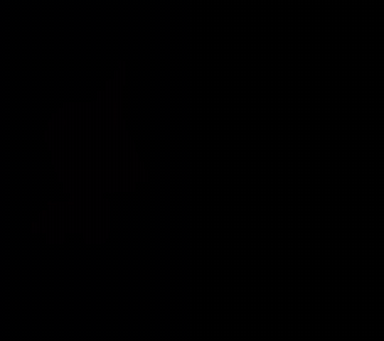

# reelsmith

**Paste any motion-graphics video. Get it back as code: rebuilt 1:1, so you can learn exactly how it was made and tweak every edit.**

reelsmith is a Claude Code plugin that rebuilds Instagram Reels, TikToks, Shorts and promos made of motion graphics as editable code: 3D product shots, UI mockups, kinetic type, camera moves and paper cut. It **measures** the reference, frame by frame:

- which easing each move uses, and how long it takes
- the inertial bounce, springs and motion blur
- 3D tilts and the camera
- text animators
- which beat of the song each move lands on

Then it rebuilds the video and scores itself against the original, shot by shot, and loops until they match. Swap in your brand, words and assets, and render.


<sub>Left: the original reel by [@yowerse](https://www.instagram.com/yowerse/) ([source](https://www.instagram.com/reel/DdJ2zCVPduR/)). Right: the reelsmith rebuild. The motion was measured, and every shot was matched to the original by score (95.8% similarity on moving pixels). Shown for learning; see [how it was made](plugins/reelsmith/skills/reelsmith/examples/build-with-claude-1to1).</sub>

```text
/reelsmith https://www.instagram.com/reel/...
```

## What happens when you paste a link

1. **Measure.** It downloads the reel and finds every cut. It transcribes the voice with word timings, samples exact colours and makes labelled frame sheets.
2. **Watch.** Claude studies each scene, then writes down every object's position, size, colour and motion in pixels, plus when each caption changes.
3. **Build.** Every scene becomes a function of time on a small canvas engine. It covers chrome, glass and glow, reflective floors, camera moves, motion blur, captions timed to the voice, real brand logos, and paper-cut layers with stop-motion boil.
4. **Compare.** It renders frames and stacks them against the original at the same timestamps. It fixes what's off and compares again until the two are hard to tell apart.
5. **Render.** You get an MP4, a side-by-side comparison video, and a project folder you can edit.

Then ask for a variation: *"make a version about Bitcoin vs Gold for my brand."* The scenes are already code, so it's mostly swapping words, logos and colours.

## Install

In Claude Code:

```text
/plugin marketplace add SamanwayBaranwal/reelsmith
/plugin install reelsmith@reelsmith
```

Or copy the skill folder into any agent that reads `SKILL.md` files:

```bash
git clone https://github.com/SamanwayBaranwal/reelsmith
cp -r reelsmith/plugins/reelsmith/skills/reelsmith ~/.claude/skills/
```

### Requirements

| Tool | Why | Install |
|---|---|---|
| ffmpeg | frames, audio, encoding | `brew install ffmpeg` · `winget install Gyan.FFmpeg` · `sudo apt install ffmpeg` |
| Node 18+ | the renderer (headless Chromium) | `brew install node` · `winget install OpenJS.NodeJS.LTS` |
| uv | runs the analyzer and installs its Python packages | `brew install uv` · `winget install astral-sh.uv` |
| yt-dlp | downloads the reel (optional: fetched on demand through uv) | `brew install yt-dlp` |

`python3 plugins/reelsmith/skills/reelsmith/scripts/check.py` checks everything. The first analysis downloads a speech model (~480 MB, once).

## Use

Just talk to Claude Code:

- `rebuild this reel in code: <link>`
- `make this exact video but for my brand <name>, here's my voiceover: voice.mp3`
- `recreate this paper cut reel: <link>`

Each reel gets a project folder:

```text
reels/<name>/
  video.js        the scenes (this is what you edit)
  engine.js       the canvas engine
  logos.js        brand marks (pulled from official SVGs / Simple Icons)
  project.json    size, fps, duration, reference, audio
  ref/            the reference video, analysis, sheets, comparisons
  out/            video.mp4 and side_by_side.mp4
```

You can drive the project tool yourself too:

```bash
node reel.mjs compare s3 3.2 4.2 4.7   # reference (top) vs ours (bottom)
node reel.mjs color 4.2 0.5,0.31       # exact colour from the reference
node reel.mjs logo solana              # add a brand mark
node reel.mjs make                     # render + encode → out/video.mp4
```

## reelsmith motion: After Effects for agents (new, in progress)

[`motion/`](motion) is the next engine and has two halves:

- **Engine:** an agent writes a comp as plain data (layers, keyframes, After Effects eases, inertial bounce, springs, text animators, glow, track mattes, precomps, per-layer motion blur, `beat:N` timing) and it renders to MP4.
- **Analyser (After Effects in reverse):** it watches a video and reports which animation each element uses, how long each move takes, what bounce or spring it has, its motion blur, and which beat it lands on. It then rebuilds the video from that report and scores itself against the original.


<sub>Left: a test video with known animations. Right: what the analyser rebuilt from its own measurements, scoring 99.3% on moving pixels. It recovered `pop`, `out`, `smooth`, `back`, `inOut` and `whip` with the right timing, plus the inertial bounce and the 180° motion blur.</sub>

See [`motion/README.md`](motion/README.md) for the comp format and [`motion/analyser/README.md`](motion/analyser/README.md) for the analyser.

## Examples

### Build with Claude: 1:1 rebuild (new)

[`examples/build-with-claude-1to1`](plugins/reelsmith/skills/reelsmith/examples/build-with-claude-1to1) is the GIF at the top. It has eight shots: a camera-tracked chat UI with typing, 3D dashboard cards, a MacBook whip-spin pose-fitted to the reference, and a planet end card drawn from per-frame measurements. The example includes the analysis commands, the measurement scripts and the fix loop.

### Build with Claude: first, hand-built version



[`examples/build-with-claude`](plugins/reelsmith/skills/reelsmith/examples/build-with-claude) is the same reel built by hand before the analyser existed (91% similarity, against 95.8% for the measured rebuild). It is a 12.9 s, 16:9 product promo: a spark morphs into the Claude mark, then come a chat UI, flying 3D dashboard cards, a three.js laptop and a planet-sunrise title. Every cut and pop is placed on the song's beats. The motion curves (arrow path, laptop spin, planet drop) were measured frame by frame from the original.

## What it can and can't do

- **Can:** motion graphics, 3D-render-style scenes (chrome, glass, neon), kinetic typography, app and UI mockups, chart animations, logo reveals, paper cut and collage, flat vector explainers. It also does real 3D product shots through three.js (like the laptop in the Claude example), music-synced cuts, and both 9:16 and 16:9.
- **Can't:** live-action footage, real faces or voices, or complex photoreal 3D scenes. Mixed reels get their graphic parts rebuilt, and it tells you which shots need your own footage.

## Learning, credit and fair use

reelsmith is for **learning**. Rebuild a video to see exactly how it was animated (eases, timing, camera, beat sync), then make *your own* with your brand, words and voice.

- **Credit the original creator** whenever you show a rebuild. This repo credits @yowerse for the showcase above.
- **Don't re-upload someone else's video as yours**, and don't strip watermarks or branding.
- **Rights:** use references you're allowed to study. The examples never ship frames of the original reels; the scripts cut what they need from your own copy.
- **Assets:** brand logos are for identification only. Third-party assets keep their own licenses (the MacBook model is CC BY 4.0; credit the author).

## License

MIT © SamanwayBaranwal
