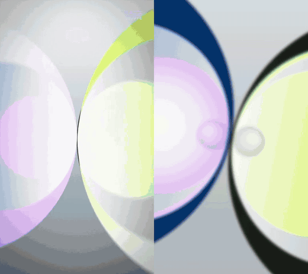

# reelsmith

**Paste a motion-graphics reel. Get it back as code.**

reelsmith is a Claude Code plugin that rebuilds Instagram Reels, TikToks and Shorts made of motion graphics (3D-render explainers, kinetic type, UI mockups, paper cut) as editable canvas code. It renders them back out as a 1080×1920 MP4. Change the words, the brand, the colours or the voiceover, then render again.



<sub>Left: the original reel. Right: rendered entirely from code by reelsmith. No footage was copied; every object, logo, caption and camera move is drawn on a canvas.</sub>

```text
/reelsmith https://www.instagram.com/reel/...
```

## What happens when you paste a link

1. **Measure.** It downloads the reel and finds every cut. It transcribes the voice with word timings, samples exact colours and makes labelled frame sheets.
2. **Watch.** Claude studies each scene, then writes down every object's position, size, colour and motion in pixels, plus when each caption changes.
3. **Build.** Every scene becomes a function of time on a small canvas engine. It covers chrome, glass and glow, reflective floors, camera moves, motion blur, captions timed to the voice, real brand logos, and paper-cut layers with stop-motion boil.
4. **Compare.** It renders frames and stacks them against the original at the same timestamps. It fixes what's off and compares again until the two are hard to tell apart.
5. **Render.** You get an MP4, a side-by-side comparison video, and a project folder you can edit.

Then ask for a variation: *"make a version about Bitcoin vs Gold for my brand."* The scenes are already code, so it's mostly swapping words, logos and colours.

## Install

In Claude Code:

```text
/plugin marketplace add SamanwayBaranwal/reelsmith
/plugin install reelsmith@reelsmith
```

Or copy the skill folder into any agent that reads `SKILL.md` files:

```bash
git clone https://github.com/SamanwayBaranwal/reelsmith
cp -r reelsmith/plugins/reelsmith/skills/reelsmith ~/.claude/skills/
```

### Requirements

| Tool | Why | Install |
|---|---|---|
| ffmpeg | frames, audio, encoding | `brew install ffmpeg` · `winget install Gyan.FFmpeg` · `sudo apt install ffmpeg` |
| Node 18+ | the renderer (headless Chromium) | `brew install node` · `winget install OpenJS.NodeJS.LTS` |
| uv | runs the analyzer and installs its Python packages | `brew install uv` · `winget install astral-sh.uv` |
| yt-dlp | downloads the reel (optional: fetched on demand through uv) | `brew install yt-dlp` |

`python3 plugins/reelsmith/skills/reelsmith/scripts/check.py` checks everything. The first analysis downloads a speech model (~480 MB, once).

## Use

Just talk to Claude Code:

- `rebuild this reel in code: <link>`
- `make this exact video but for my brand <name>, here's my voiceover: voice.mp3`
- `recreate this paper cut reel: <link>`

Each reel gets a project folder:

```text
reels/<name>/
  video.js        the scenes (this is what you edit)
  engine.js       the canvas engine
  logos.js        brand marks (pulled from official SVGs / Simple Icons)
  project.json    size, fps, duration, reference, audio
  ref/            the reference video, analysis, sheets, comparisons
  out/            video.mp4 and side_by_side.mp4
```

You can drive the project tool yourself too:

```bash
node reel.mjs compare s3 3.2 4.2 4.7   # reference (top) vs ours (bottom)
node reel.mjs color 4.2 0.5,0.31       # exact colour from the reference
node reel.mjs logo solana              # add a brand mark
node reel.mjs make                     # render + encode → out/video.mp4
```

## Examples

### Build with Claude (new)


[`examples/build-with-claude`](plugins/reelsmith/skills/reelsmith/examples/build-with-claude) is a 12.9 s, 16:9 product promo: a spark morphs into the Claude mark, then come a chat UI, flying 3D dashboard cards, a three.js laptop and a planet-sunrise title. Every cut and pop is placed on the song's beats. The motion curves (arrow path, laptop spin, planet drop) were measured frame by frame from the original.

### Solana vs Robinhood

[`examples/solana-vs-robinhood`](plugins/reelsmith/skills/reelsmith/examples/solana-vs-robinhood) is a full 10-scene, 23.8 s crypto explainer rebuilt this way (the GIF at the top). It renders in about 40 seconds on a laptop.

## What it can and can't do

- **Can:** motion graphics, 3D-render-style scenes (chrome, glass, neon), kinetic typography, app and UI mockups, chart animations, logo reveals, paper cut and collage, flat vector explainers. It also does real 3D product shots through three.js (like the laptop in the Claude example), music-synced cuts, and both 9:16 and 16:9.
- **Can't:** live-action footage, real faces or voices, or complex photoreal 3D scenes. Mixed reels get their graphic parts rebuilt, and it tells you which shots need your own footage.

## Fair use

Use it to learn a style and to make your own content. Don't re-upload someone else's video as yours, and don't strip another creator's watermark or branding. Rebuild with your own brand, words and voice. Brand logos are for identification only.

## License

MIT © SamanwayBaranwal
